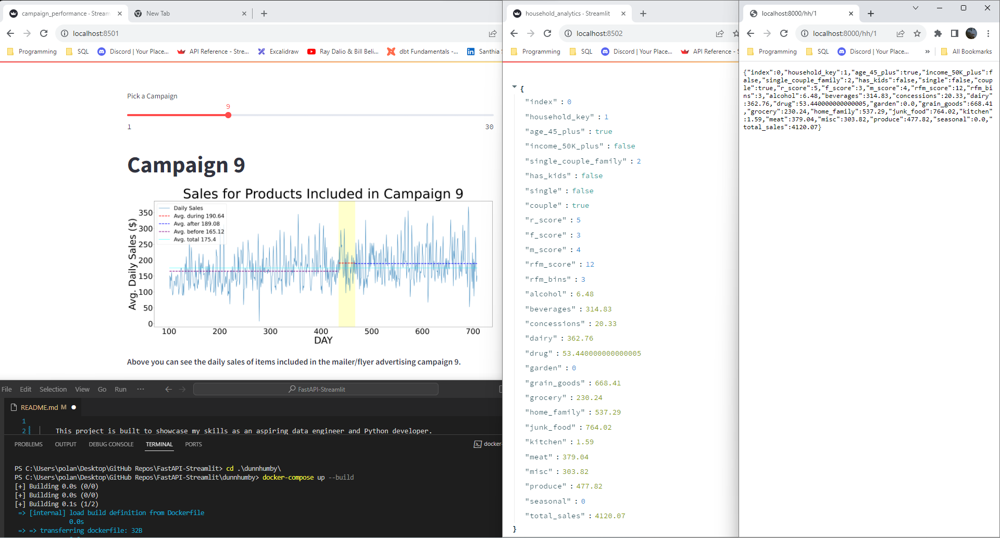

    
    This project is built to showcase my skills as an aspiring data engineer and Python developer.

    simply run `docker-compose up` in the dunnhumby folder, then navigate to 
        
        localhost:8051 -- "coupon campaign performance" interactive visual with streamlit.
        localhost:8052 -- household-level analytics template
        localhost:8000/hh/1 -- underlying endpoint

    ...in your browser to see the three containerized applications running at once. 

    FastAPI-App
        - Automation/CRON jobs produces highly-available insight tables in the data warehouse
            - Customer Analytics Summary table
            - Customer Product Recommendations table
    API layer implemented with FastAPI:
        - FastAPI with uvicorn
        - pydantic 'schemas' define potential for API transactions
        - sample endpoint accessed through SQLAlchemy ORM

    Front-end with Streamlit:
        - streamlit app calls to FastAPI though localhost port forwarding

    Deployment with Docker:
        - docker-compose to start all 3 applications at once

### FILES IN THIS PACKAGE ###

`dunnhumby_data_warehouse.py` holds DunnHumbyDataWarehouse -- a simulated data processing class I wrote to migrate/update the database.

    - datasource to database migration processing (in this case simply from static .csv); simulated batch/cron jobs
    
    - coordinates data intake to our base truth tables -- `hh_summary` and `daily_hh_spend_by_section` (not demonstrated here)
    
    - ETL processing

# Database Setup and Functionality

`models.py` holds SQLAlchemy ORM models/database table schemas

`database.py` holds the engine and SessionLocal variables which instantiate and power our SQLALchemy Database

# API Functionality

`schemas.py` for the API transaction definitions; FastAPI/pydantic data models/schemas

`main.py` holds the FastAPI application and defines the API endpoints

`crud.py` holds endpoint functions

# Streamlit Front-Ends
`campaign performance`
`customer-level analytics`
